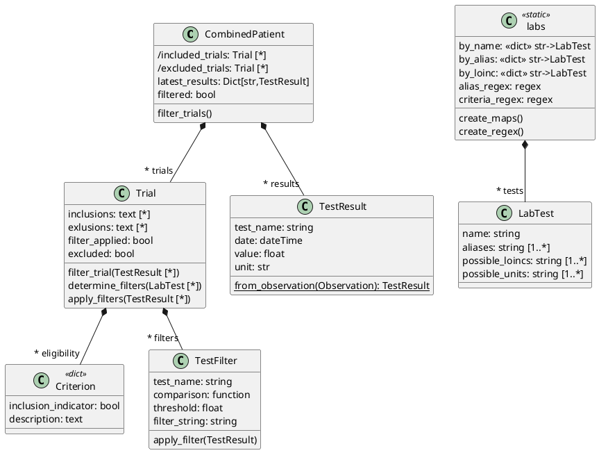

---
markdown:
  image_dir: /assets
  path: output.md
  ignore_from_front_matter: true
  absolute_image_path: false
---

```plantuml
@startuml trialmodel
    class CombinedPatient {
        /included_trials: Trial [*]
        /excluded_trials: Trial [*]
        latest_results: Dict[str,TestResult]
        filtered: bool
        filter_trials()
    }
    class Trial {
        inclusions: text [*]
        exlusions: text [*]
        filter_applied: bool
        excluded: bool
        filter_trial(TestResult [*])
        determine_filters(LabTest [*])
        apply_filters(TestResult [*])
    }
    class Criterion <<dict>> {
        inclusion_indicator: bool
        description: text
    }
    class TestFilter {
        test_name: string
        comparison: function
        threshold: float
        filter_string: string
        apply_filter(TestResult)
    }
    class LabTest {
        name: string
        aliases: string [1..*]
        possible_loincs: string [1..*]
        possible_units: string [1..*]
    }
    class labs <<static>> {
        by_name: <<dict>> str->LabTest
        by_alias: <<dict>> str->LabTest
        by_loinc: <<dict>> str->LabTest
        alias_regex: regex
        criteria_regex: regex
        create_maps()
        create_regex()
    }
    class TestResult {
        test_name: string
        date: dateTime
        value: float
        unit: str
        {static} from_observation(Observation): TestResult
    }

    CombinedPatient *-- "~* trials" Trial
    CombinedPatient *-- "~* results" TestResult
    Trial *-- "~* filters" TestFilter 
    Trial *-- "~* eligibility" Criterion 
    labs *-- "~* tests" LabTest 
@enduml
```